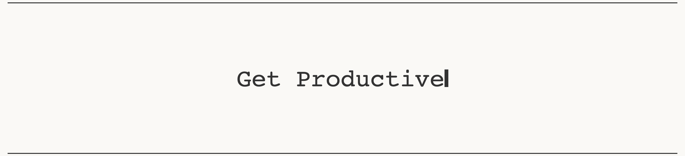
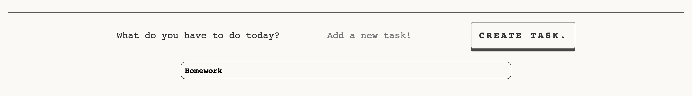

# To Do List 
This site is made to help users keep track of their daily tasks, and mark them as complete when they have completed them. I made this using a slightly off-white theme (with an option to change to a darker theme if the user wishes to) and a minimalist design to keep the users focused on inputting and completing their daily goals. 

## Features

### Site Header 

- Modal pop-up.
    - This feature is placed in the top-left of the screen. When clicked, it gives the instructions to use.
    - Within this modal, the three steps of inputting a task, marking as complete, and removing it from the list.
    - The user can then close the modal by clicking on the “ X “ symbol in the top right of the modal.
- Date.
    - This feature is in place as the goal of the website is to help users complete small daily tasks.
    - I also believe that having a reminder of the date on top of the screen creates a sense of a deadline for the user, leading to a higher probability of the user completing their tasks.
- Change theme.
    - Changing the theme on this site is to help improve the user experience.
    - Some users with visual impairments may find one theme easier to read than the other or one may cause less eye strain than the other. Offering a light and dark theme makes this site more accessible to more users.
    - Having the option to change the theme lets people personalize the site. They can choose which site view they prefer, improving their user experience.
### Auto-Generated Text.

- Using a to-do list can be a powerful tool for managing your time and staying organized, and we want to encourage our users to give it a try. That’s why we display messages like “get organized” and reduce stress.
- This section is here to encourage the user to use the list to get these benefits.
### Input Area.

- I’ve included an input area on our website that allows you to add tasks to your to-do list quickly and easily.
- It starts with a prompt “What do you have to do today?” followed by an input area for the user to type in their tasks. When they press the enter key or tap on the “create task” it is then added to the list for the user to see.
### List Area.

- When a user enters a task, it is added to a list below the input area. Here the user can view their task list, and click it once to mark it as complete with a line through the text. To delete the task, a double click on the list item will remove the task from the list.
## Features Left To Implement.
- A progess bar above the list that increase in size realtive to the number of task they have completed and the total number of task they want to complete. 
## Validator Testing
### HTML
- No errors were returned when passing through the official W3C validator
### CSS
- No errors were found when passing through the official validator : Jigsaw
### JavaScript
- No errors were found when passing through the official validator : JShint 
## Unfixed Bugs
- The theme change button does not work on the first click, it will only change the theme on the second click. 
    - I was unable to fix this bug, I think it may be due to the mouseenter/mouseleave events in the js file effecting the event listener of the first click. However, this could be in correct. I hope to fix this in the future. 
- The double click function to remove tasks from the list does not work when the page is being inspected usng chrome dev tools. I am unsure of why this is ocurring. 
## Deployment
The site was deployed to GitHub pages.
