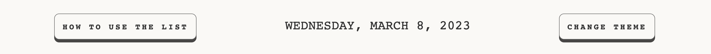

# To Do List 
This site is made to help users keep track of their daily tasks, and mark them as complete when they have completed them. I made this using a slightly off-white theme (with an option to change to a darker theme if the user wishes to) and a minimalist design to keep the users focused on inputting and completing their daily goals. 

## Features

### Site Header 

### Header Bar.

- Modal pop-up.
    - This feature is placed in the top-left of the screen. When clicked, it gives the instructions to use.
    - Within this modal, the three steps of inputting a task, marking as complete, and removing it from the list.
    - The user can then close the modal by clicking on the “ X “ symbol in the top right of the modal.
- Date.
    - This feature is in place as the goal of the website is to help users complete small daily tasks.
    - I also believe that having a reminder of the date on top of the screen creates a sense of a deadline for the user, leading to a higher probability of the user completing their tasks.
- Change theme.
    - Changing the theme on this site is to help improve the user experience.
    - Some users with visual impairments may find one theme easier to read than the other or one may cause less eye strain than the other. Offering a light and dark theme makes this site more accessible to more users.
    - Having the option to change the theme lets people personalize the site. They can choose which site view they prefer, improving their user experience.